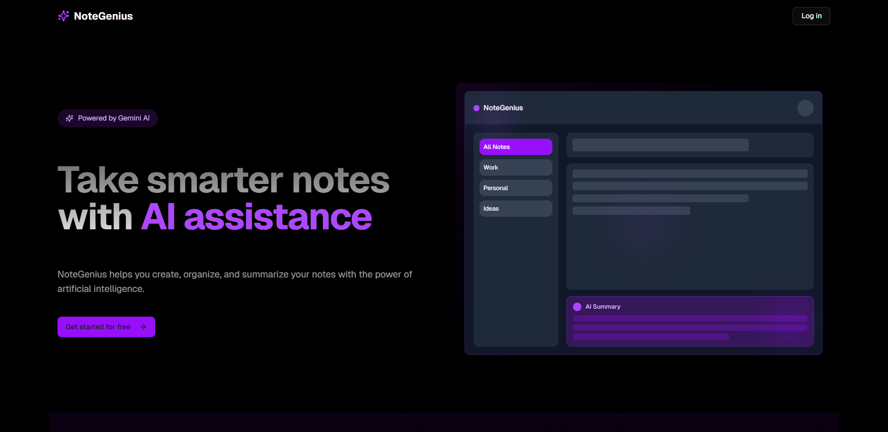
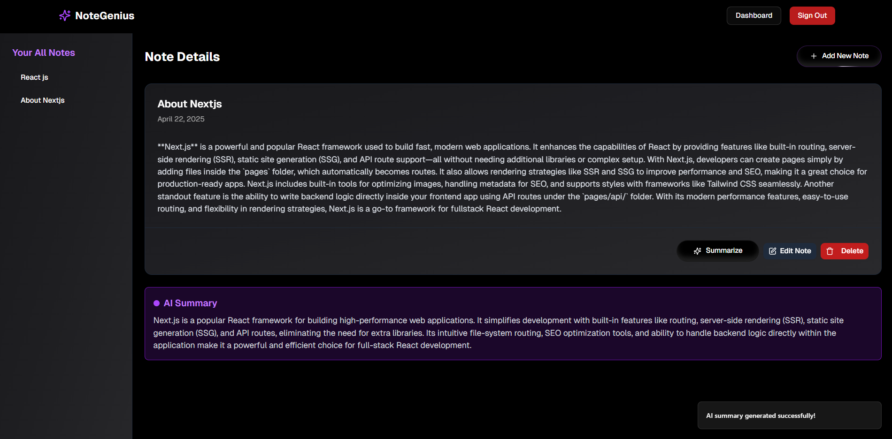

# NoteGenius

This is a personal AI-powered note-taking application built with Next.js, TypeScript, and Supabase. It allows users to create, manage, and summarize their notes efficiently.

### Deployed Link - https://notes-genius-v0.vercel.app/




## Features

* **Note Creation and Editing:** Easily create new notes and edit existing ones with a simple and intuitive interface.
* **Note Listing:** View all your notes in a clear and organized manner.
* **Individual Note View:** Access and review the full content of any specific note.
* **AI-Powered Summarization:** Quickly get the key takeaways from your notes using the integrated summarization feature powered by the Gemini AI API.
* **User Authentication:** Secure user accounts with Google Sign-in.
* **Dashboard:** A central place to view and manage your notes.

## Technologies Used

* **Next.js:** A React framework for building server-rendered and statically generated web applications.
* **TypeScript:** A statically typed superset of JavaScript that enhances code maintainability and reduces errors.
* **Supabase:** An open-source Firebase alternative that provides a PostgreSQL database, authentication, storage, and more.
* **React Query:** A library for managing and caching asynchronous data in React applications.
* **Shadcn UI:** A collection of accessible and reusable UI primitives built with Radix UI and Tailwind CSS.
* **Tailwind CSS:** A utility-first CSS framework for rapid UI development.
* **Gemini AI API:** Google's powerful language model used for note summarization.

## Getting Started to run this on your machine

1.  **Clone the repository:**
    ```bash
    git clone https://github.com/isayanpal/ai-notes
    cd ai-notes
    ```

2.  **Install dependencies:**
    ```bash
    npm install
    # or
    yarn install
    # or
    pnpm install
    ```

3.  **Set up Supabase:**
    * Create a new project on [Supabase](https://supabase.com/).
    * Obtain your Supabase API URL and public API key from your project settings.
    * Update the `.env.local` file (create one if it doesn't exist) with your Supabase credentials and your Gemini AI API key:

        ```
        NEXT_PUBLIC_SUPABASE_URL=YOUR_SUPABASE_URL
        NEXT_PUBLIC_SUPABASE_ANON_KEY=YOUR_SUPABASE_PUBLIC_API_KEY
        NEXT_PUBLIC_GEMINI_API_KEY=YOUR_GEMINI_API_KEY
        ```

4.  **Run the development server:**
    ```bash
    npm run dev
    # or
    yarn dev
    # or
    pnpm dev
    ```

    Open your browser and navigate to `http://localhost:3000`.